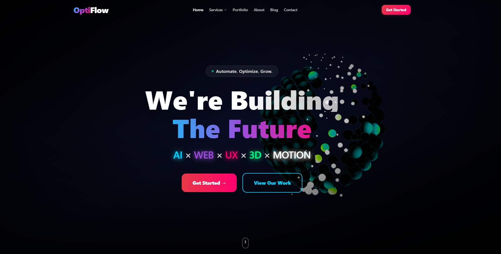
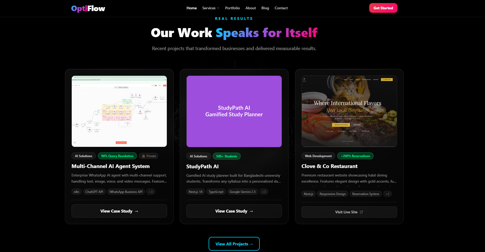
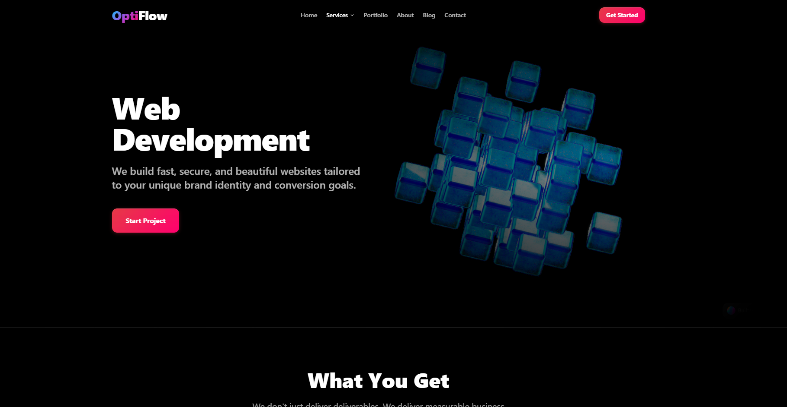

# OptiFlow

> A modern digital experience focused on AI-powered solutions, business automation, and high-quality web development.

[](https://optiflow-beta.vercel.app/)
[](https://nextjs.org/)
[](https://www.typescriptlang.org/)
[](https://tailwindcss.com/)

## Overview

OptiFlow is a full-stack Next.js project created to showcase AI solutions, business automation, digital products, and modern interactive web experiences.

This public repository is the **showcase version** of OptiFlow. The main development repository is kept private while the project continues to evolve.

## Highlights

- AI-powered product and application concepts
- Business workflow automation solutions
- Modern responsive UI and reusable React components
- Interactive motion and polished user experiences
- Portfolio and case-study presentation sections
- Contact, form, and validation flows
- Production-oriented Next.js architecture
- 3D-ready visual components without exposing private scene URLs

## Tech Stack

| Category | Technologies |
| --- | --- |
| Framework | Next.js 14, React 18 |
| Language | TypeScript |
| Styling | Tailwind CSS |
| Animation | Framer Motion |
| Forms | React Hook Form, Zod |
| Icons | Lucide React |
| APIs | Google APIs |
| 3D | Spline-compatible architecture |
| Deployment | Vercel |

## Project Preview

### Home



### Portfolio



### Services



## Project Structure

```text
src/
├── app/            # Next.js routes and pages
├── components/     # Reusable UI and feature components
│   ├── 3d/
│   ├── analytics/
│   ├── faq/
│   ├── forms/
│   ├── home/
│   ├── layout/
│   ├── portfolio/
│   └── ui/
└── lib/            # Shared utilities and application logic

public/
└── images/         # Project and showcase assets
```

## Getting Started

### 1. Clone the repository

```bash
git clone https://github.com/adnan1299otm/optiflow-.git
cd optiflow-
```

### 2. Install dependencies

```bash
npm install
```

### 3. Configure local environment

Create a `.env.local` file locally and add the environment values required by your setup.

Never commit `.env.local`, API keys, tokens, or other private credentials.

### 4. Start the development server

```bash
npm run dev
```

Then open `http://localhost:3000`.

## Available Scripts

```bash
npm run dev      # Start the development server
npm run build    # Create a production build
npm run start    # Start the production server
npm run lint     # Run linting
```

## Deployment

The project is structured for deployment on Vercel and other Next.js-compatible platforms.

## Project Status

OptiFlow is an active project. The public repository is maintained as a polished showcase while new features and improvements continue in the private development repository.

## Live Project

**Website:** https://optiflow-beta.vercel.app/

## Author

**Arafath Al Adnan**  
AI Automation Engineer · Full-Stack Developer · Python Developer

- GitHub: https://github.com/adnan1299otm
- Portfolio: https://www.arafath-al-adnan.work.gd/
- LinkedIn: https://www.linkedin.com/in/arafathaladnan/
